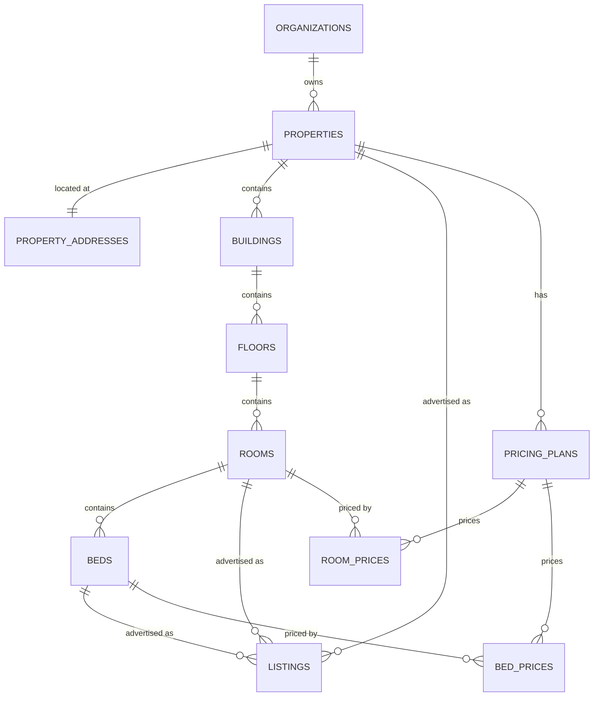
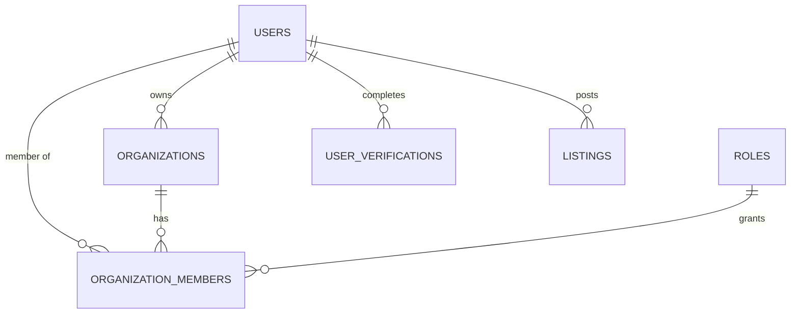
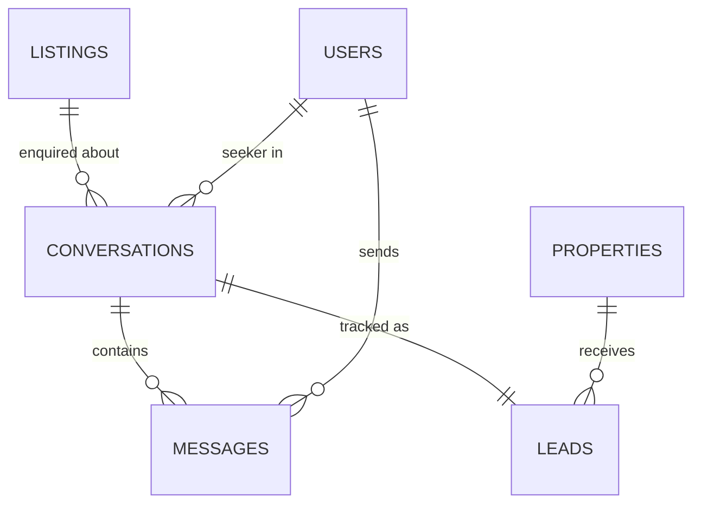
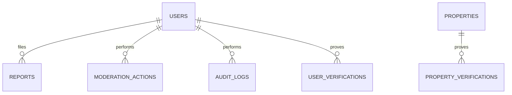

# Database Schema

PostgreSQL via Prisma. The schema itself is
[backend/prisma/schema.prisma](../backend/prisma/schema.prisma), which carries
per-table reasoning in comments. This document is the map and the record of
what was decided where the ERD and the application disagreed.

**38 models, 23 enums.** All 25 tables from `backend/backend db/roombazar_erd.pdf`
are present.

## Where the schema came from

Two sources, reconciled rather than one replacing the other.

**From the ERD:** the multi-tenant operator side — organizations with roles and
members, and the `property → building → floor → room → bed` inventory tree with
per-unit pricing plans. Plus `property_types`, `room_types`, `bed_types`,
`property_addresses`, `media`, `property_verifications`, `audit_logs`.

**From the application:** the peer-to-peer side — conversations, messages,
mutual contact reveal, trust levels, reports, moderation actions, saved listings
and saved searches.

## The core split: property vs listing

This is the decision everything else hangs off.

A **property** is the physical asset. A **listing** is an advertisement for some
part of it. A listing points at a property, and optionally at one specific room
or bed.

That split is what lets one schema serve both halves of this market:

| | Property | Listings |
| --- | --- | --- |
| Private owner, one spare room | 1 | 1, no room or bed set |
| Flatmate replacing someone | 1 | 1, `room_id` set |
| PG operator, 40 beds | 1 | one per bed type, `bed_id` set |

[01-data-model.md](01-data-model.md#open-questions) left this open —
"modelling each bed as a Listing floods search; modelling the property as one
Listing loses per-bed availability." The ERD answers it, and this is that answer.

## Identity and organizations

**Every property belongs to an organization**, including a private individual
letting one room — signing up provisions a personal organization, flagged
`is_personal` so the UI never shows organization management to someone who did
not ask for it.

The alternative was a nullable `organization_id` with an owner fallback. That
puts a two-branch ownership check in every authorisation path, and the branch
that runs less often is the one that eventually has the bug. One code path is
worth an ordinary-looking row.

**Two kinds of role, deliberately.** `users.platform_role` is site-wide
(user / moderator / admin). `organization_members.role_id` is scoped to one
organization (owner / manager / staff). Someone can be staff at a PG and a site
moderator; collapsing these would make that unrepresentable.

## Messaging, and what happened to LEADS

The ERD had `LEADS (customer_id, property_id, status)` and **no messages table**.
That is the lead-generation model: capture a seeker's details, hand them to the
operator, track a status to conversion.

It is also the exact inverse of this product's premise — no middleman, contact
details exchanged only on mutual consent — and it would have orphaned the
conversations module, the redaction rules, and the frontend inbox.

So `leads` was kept and **reconciled instead of substituted**: a lead is a
pipeline view over a conversation.

`leads.conversation_id` is **unique and required**. There is no path that creates
a lead from a bare contact form. An operator managing forty beds gets the funnel
they need; contact details still travel only through mutual reveal.

**Mutual reveal** is two nullable timestamps on `conversations`, not one boolean.
Both must be set before either party sees a phone number, and storing them
separately means a disputed reveal can be answered with who agreed and when.

**Messages store the original and the masked version.** `body` is verbatim and
retained for moderation; `redacted_body` is what the other party sees until both
have revealed. `redaction_matches` records which categories tripped, because
deliberate evasion is a stronger signal than the redaction itself.

## Trust and safety

**Two verification tables, on purpose.** `user_verifications` proves who someone
is; `property_verifications` proves they control an address. They are different
claims, and "Ownership verified" is the strongest badge a listing can carry.

Neither has a column for an Aadhaar number. We store a provider reference and
the name-match outcome — holding the number is a regulatory liability with no
product benefit.

**`moderation_actions` is append-only** and every entry requires a note. An audit
row reading only "suspended" is not accountability; the note is what makes the
decision reviewable on appeal. `audit_logs` is the broader activity trail and
carries `request_id`, which correlates to the `x-request-id` header the API
returns.

## Conventions

**Money is integer paise. Never Decimal, never Float.** The ERD specified
`decimal amount`; paise is used instead because the whole application contract —
frontend types included — is already integer paise, and mixing representations
across a boundary is how rounding drift starts. `1500000` is ₹15,000.

**Deposits are stored twice**, as `deposit_months` and `deposit_paise`. Listers
quote in months, seekers compare in months, and the absolute figure is what gets
filtered and displayed. Deriving either one on the fly loses information about
what the lister actually chose.

**Timestamps are `timestamptz`**, always UTC in the database, rendered in IST at
the edge.

**Soft deletes** on users, organizations, properties and listings. Users in
particular must survive deletion, because messages that are evidence in an open
report are anonymised rather than removed.

## Deliberate denormalisation

Three places, each with a reason:

`listings.rent_paise`, `city_id` and `locality_id` are copied from the pricing
plan and the property address. Search filters a rent range and a locality on
every query, and joining three tables on the hottest path in the product is not
worth the normalisation purity. The copy is written on publish and on edit.

`listings.rank_score` is precomputed. Sorting on an expression cannot use an
index. It blends recency, completeness and lister trust — and deliberately not
rent, because cheapest-first ranking rewards bait pricing.

`localities.median_rent_paise` and `active_listing_count` back the locality
landing pages, which are the main organic entry point. Recomputed on a schedule.

## Privacy at the schema level

`property_addresses` is a separate one-to-one table rather than columns on
`properties`, so the sensitive fields sit somewhere no read path touches by
accident. `address_line`, `latitude` and `longitude` never leave the server —
the API serves coordinates fuzzed to roughly 300m, because an exact pin on a
room someone lives in invites address harvesting and is a safety risk for
whoever lives there.

`media.exif_stripped` records that GPS was removed on ingest. A room photo with
EXIF coordinates would leak the address the schema is careful to keep back.

`listings.preferred_tenant` is a closed enum array with no free-text escape.
Free-form tenant preferences in this market routinely encode caste and religion
filters; a fixed list makes that impossible to express in structured data. See
[03-trust-and-safety.md](03-trust-and-safety.md#tenant-preferences).

## Indexes

The ones that matter, all declared in the schema:

| Index | Query it serves |
| --- | --- |
| `listings(city_id, status, rank_score)` | The primary search path |
| `listings(locality_id, status, rent_paise)` | Locality page with a rent filter |
| `listings(status, expires_at)` | Nightly expiry sweep |
| `conversations(lister_id, last_message_at)` | Owner inbox |
| `conversations(seeker_id, last_message_at)` | Seeker inbox |
| `messages(conversation_id, created_at)` | Thread rendering |
| `reports(target_type, target_id, reason)` | Report counting for auto-transition |
| `media(perceptual_hash)` | Duplicate-photo detection |

Partial indexes on `status = 'active'` are worth adding once there is volume:
active listings become a shrinking minority of the table within a year, and
search only ever touches them. Prisma cannot express partial indexes, so those
go in a hand-written migration.

## Not yet done

- **No migration has been run.** The schema validates; nothing has touched a
  database. See the warning below.
- Prisma repository adapters implementing the six ports in
  `backend/src/persistence/ports`. Until those exist the API still runs on the
  in-memory adapters.
- Seed script for states, cities, localities with aliases, amenities, and the
  property/room/bed type lookups. Curating the locality alias list per city is
  real work and a launch blocker, not a nice-to-have.
- Partial indexes and the full-text search column, both needing raw SQL.

> **Before running any migration:** the `DATABASE_URL` currently in
> `backend/.env` was committed to git history and pushed to a public GitHub
> repository. That credential should be treated as compromised and rotated at
> the provider before it is used further.
